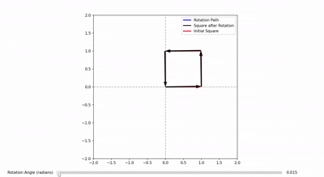
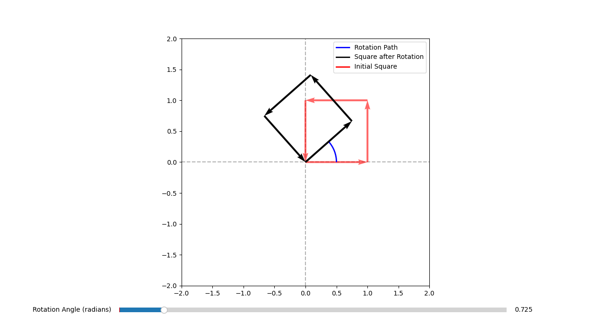

# Square Hinged Rotation Animation
This project demonstrates the rotation of a square constructed using vectors in a 2D plane. The square's edges are represented as vectors, and the entire shape is rotated around a fixed corner at (0, 0) using a rotation matrix. The rotation is visualized step-by-step, with an interactive slider to control the rotation angle:



Check out my other repository, [Vector Rotation using Rotation Matrix](https://github.com/BogdanVlad06/Rotation-Matrix-aplication/tree/main), which tackles the mathematical foundation and analogy behind vector rotations.

---

## Visuals

Example visualization of the rotating square. The corner at (0, 0) remains fixed during rotation.



Also mp4 demonstration in [examples](examples/) file

---

## Features

- **Vector-Based Square Construction**: The square is constructed using vectors for its edges, allowing for precise control over its shape and rotation.
- **Fixed Rotation Point**: The square rotates around the fixed corner at `(0, 0)`.
- **Interactive Rotation**: A slider is provided to interactively rotate the square by adjusting the angle in radians.
- **Visualization of Rotation**: The rotation is visualized with:
  - A **blue arc** showing the rotation path.
  - A **black square** representing the rotated state.
  - A **red square** representing the initial state.
- **Matplotlib Animation**: The project uses Matplotlib's animation and interactive widgets to create a dynamic visualization.

---

## How It Works
1. **Square Construction**:
   - The square is defined by its corner coordinates (`coords`) and edge directions (`dirxy`).
   - The corner at `(0, 0)` remains fixed, and the square rotates around this point.
   - Vectors are created using `matplotlib.quiver` to represent the edges of the square.

2. **Rotation**:
   - A rotation matrix is applied to the edge vectors to rotate them by a given angle.
   - The square's coordinates are updated based on the rotated vectors, while the corner at `(0, 0)` stays fixed.

3. **Interactive Slider**:
   - A slider allows users to adjust the rotation angle interactively.
   - The rotation is visualized in real-time, with the arc and square updating dynamically.

---

## Install - using Git
1. Clone the repository:
   ```bash
   git clone https://github.com/BogdanVlad06/Hinged-Square-Rotation-Application/tree/main

2. To setup virtual environment:
   ```bash
   python -m venv venv
   venv\Scripts\activate
3. Install dependencies:
   ```bash
   pip install -r requirements.txt
